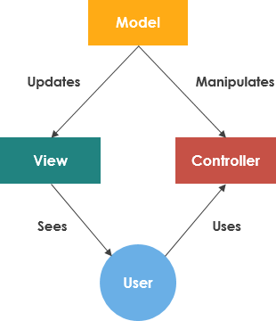

# Laporan Modul 1: Perkenalan Laravel
**Mata Kuliah:** Workshop Web Lanjut   
**Nama:** Nabil Gathfan Putra Mulyana
**NIM:** 2024573010
**Kelas:** TI-2B

---

## Abstrak 
Tuliskan ringkasan singkat tentang isi laporan ini dan tujuan Anda membuat laporan.
    Pengenalan framework Laravel, definisi, komponen utama, dan struktur framework. Serta penjelasa mengenai Sistem MVC (model, view, controller) melalui diagram.

---g

## 1. Pendahuluan
    Laravel adalah framework PHP open-source yang sering dipakai untuk memudahkan dan mempercepat pengenmbangan web. Framework ini menggunakan pola arsitektur MVC (Model, View, Controller) untuk membagi tampilan website, logika website, dan data di dalam website. Laravel juga merupakan framework dengan sifat opionionated, yang dimana framework ini sudah menyediakan struktur dan fitur-fitur siap pakai yang membuat kode antar projek menjadi konsisten. Pengembang yang menggunakan framework ini untuk membangun berbagai macam aplikasi seperti: aplikasi manajemen, platform e-commerce, platform pendidikan, blog, dll. 

---

## 2. Komponen Utama Laravel (ringkas)
    Tuliskan penjelasan singkat (1–3 kalimat) untuk tiap komponen berikut:
    - Blade (templating)
        Template component UI yang akan dirender.
    - Eloquent (ORM)
        Pemetaan relasional yang memungkinkan interaksi program dengan database tanpa menulis syntax SQL secara manual.
    - Routing
        Respon HTTP request dinamis yang mendukung banyak jenis route.  
    - Controllers
        Logika/fungsi yang digunakan di dalam website
    - Migrations & Seeders
        Interaksi program dengan database menggunakan skema yang berisi data yang akan dikirim ataupun dibuat ke dalam database.
    - Artisan CLI
        Command line-tool yang digunakan untuk mengelola aplikasi Laravel.
    - Testing (PHPUnit)
        Proses pengetesan kode yang sudah dibuat melalui integrasi untuk melihat output asli agar sesuai dengan output yang diinginkan.

---

## 3. Berikan penjelasan untuk setiap folder dan files yang ada didalam struktur sebuah project laravel.
    - Direktori App
        Merupakan folder dari kode-kode inti dari aplikasi ynag dibuat termasuk di dalamnya ada model data dan logika.
    - Direktori Bootstrap
        Tempat file app.php yang digunakan untuk menginisialisasi kerangka kerja Laravel.
    - Direktori Config
        Menyimpan file-file konfigurasi yang digunakan selama proses pembangunan aplikasi
    - Direktori Database
        Direktori yang berfungsi untuk sebagai pusat folder yang berisi file/operasi untuk mengelola database.
    - Direktori node_modules
        Menyimpan package depedensi node.js
    - Direktori Public
        Direktori yang diakses langsung oleh web server.
    - Direktori Resources
        Menyimpan file yang berkontribusi terhadap tampilan dan data yang digunakan di dalam aplikasi. 
    - Direktori Routes
        Tempat file yang mendefinisikan rute dan memetakan request http yang masuk pada aplikasi.
    - Direktori Storage
        Menyimpan dokumen-dokumen yang dihasilkan oleh framework seperti log, template, dll.
    - Direktori Tests
        Menyimpan semua file testing otomatis untuk aplikasi dengan integrasi PHPUnit.
    - Direktori Vendor
        Tempat mengelola depedensi projek.
    - File .env (environment)
        File yang menyimpan variabel konfigurasi yang digunakan di lingkungan projek/aplikasi.
    - File .gitignore
        Berisi komponen/dokumen apa yang tidak akan dimasukkan ke dalam repository github.
    - File package.json
        File yang mengelola depedensi dan script yang digunakan oleh node.js

## 4. Diagram MVC dan Cara kerjanya

    Sistem rangka yang digunakan pada Web Application Framework yang berisi Model, View, Controller
    - Model: Kerangka yang mengolah data (menyimpan, menyisipkan, merubah, dan menghapus)
    - View: Kerangka yang digunakan untuk menampilkan informasi ke pengguna dalam bentuk konten sesuai rancangannya.
    - Controller: Penghubung antara model dan view, memproses data setelah menerima reqeust dari view kemudian memperbarui database melalui model.

---

## 6. Kelebihan & Kekurangan (refleksi singkat)
    - Kelebihan:
        - Folder dan file yang terstruktur,
        - Sistem MVC yang memudahkan proses pembangunan website,
        - Ekosistem yang progresif.

    - Kekurangan:
        - Learning path yang cukup rumit
        - Terasa berat untuk device low-end

---

## 7. Referensi
Directory Structure - https://laravel.com/docs/12.x/structure
Apa itu MVC? - https://www.rumahweb.com/journal/mvc-adalah/
Modul 1 Laravel - https://hackmd.io/@mohdrzu/By0Wc1Dule#Praktikum-3---Project-Laravel-Pertama

---
